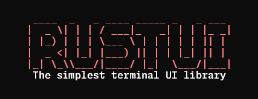
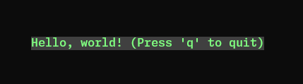
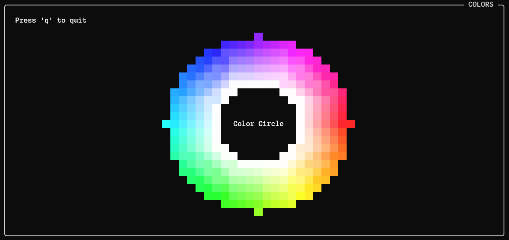
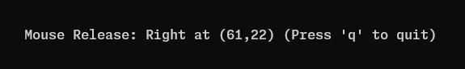
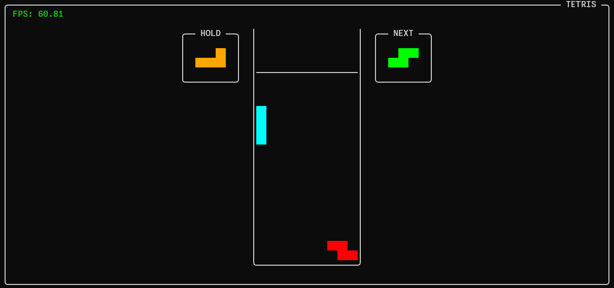

# rustui



The simplest terminal UI library designed for Rust. Developed with Rust's ownership model and safety guarantees in mind.

## Features

- **Cross-platform**: Works on Unix-like systems (Linux, macOS, etc.)
- **Double Buffering**: Efficient rendering with differential updates
- **Rich Text Styling**: Support for colors, attributes (bold, italic, underline, etc.)
- **Non-blocking Input**: Asynchronous keyboard input handling
- **Thread-safe**: Multi-threaded rendering and input processing

## Quick Start

```rust
use rustui::*;
use std::{thread, time};

const RENDERING_RATE: time::Duration = time::Duration::from_millis(16); // ms
const INPUT_CAPTURING_RATE: time::Duration = time::Duration::from_millis(10); // ms

fn main() -> Result<(), Box<dyn std::error::Error>> {
    let mut win = Window::new(false)?;
    win.initialize(RENDERING_RATE)?; // Initialize the window and start the rendering thread
    let input_rx = InputListener::new(INPUT_CAPTURING_RATE); // Create an input listener

    loop {
        // Check for key presses
        if let Ok(InputEvent::Key(Key::Char('q'))) = input_rx.try_recv() {
            break; // Exit the loop if 'q' is pressed
        }

        // Draw the frame
        win.draw(|canvas| {
            canvas.set_named_border(
                "HELLO WORLD",
                Align::Right,
                Attr::NORMAL,
                Color::White,
                Color::default(),
            ); // Set a named border for the canvas
            canvas.set_str(
                canvas.width / 2, // Center the text horizontally
                canvas.height / 2,
                "Hello, world! (Press 'q' to quit)",
                Attr::NORMAL,              // Set text decoration
                Color::Green,              // Set text color
                Color::RGB(128, 192, 128), // Set background color
                Align::Center,             // Set text alignment to center
            );
        })?;

        thread::sleep(time::Duration::from_millis(100)); // Sleep to prevent high CPU usage
    }
    Ok(())
}
```

## Example Applications

This repository includes a demo application that showcases the library's capabilities:

#### Hello World

```bash
cargo run --example hello_world
```



#### Colors

```bash
cargo run --example colors
```



#### Inputs

```bash
cargo run --example inputs
```



#### Tetris

```bash
cargo run --example tetris
```



## Platform Support

Currently supports Unix-like systems:
- Linux
- macOS
- BSD variants

Windows support may be added in future versions.

## Contributing

We sincerely appreciate your contribution to this crate. Please be sure to read the [guidelines](https://github.com/broccolingual/rustui/blob/main/CONTRIBUTING.md) before contributing.

### Development

```bash
# Clone the repository
git clone <repository-url>
cd rustui

# Build the library
cargo build

# Run tests
cargo test

# Run the demo
cargo run --example hello_world
```

## License

This project is licensed under the MIT License - see the LICENSE file for details.

---

**Note**: This library is designed for educational purposes and as a foundation for terminal-based applications. For production use, consider established libraries like `crossterm` or `ratatui-rs` depending on your needs.
